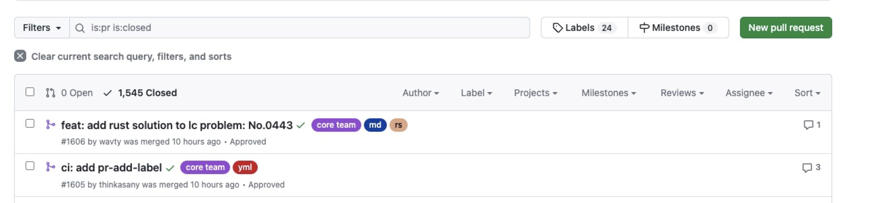

# 🌊自我介绍
pr-label自动添加工具，为您添加核心团队提交的标志和修改的文件类型...

可以从的pr列表中一眼辨别哪些是核心团队开发的，和一眼看出改动了哪儿些文件...
# 🌈实现效果
<a href="https://github.com/doocs/leetcode/pulls?q=is%3Apr+is%3Aclosed" target="_blank"></a>

# 🚀谁在用我
| # | 社区| 描述 | 热度 |
| --- | --- | --- | --- |
| 1 | [doocs/leetcode](https://github.com/doocs/leetcode) |  LeetCode solutions in any programming language 多种编程语言实现 LeetCode、《剑指 Offer（第 2 版）》、《程序员面试金典（第 6 版）》题解 | |


# 🍔 使用指南
### [示例仓库](https://github.com/doocs/leetcode/blob/main/.github/workflows/pr-add-label.yml)


### yml配置
```
name: pr-add-label

on:
  pull_request_target:
    types: [opened, edited, reopened, synchronize]

jobs:
  add-label:
    permissions:
      contents: read
      pull-requests: write
    runs-on: ubuntu-latest
    steps:
      - name: Check PR number
        id: pr_number
        run: echo "PR_NUMBER=${{ github.event.pull_request.number }}" >> $GITHUB_ENV

      - name: Run add-label Action
        uses: thinkasany/pr-label-action@master
        with:
          github_token: ${{ secrets.DOOCS_BOT_ACTION_TOKEN }}
          pr_number: ${{ env.PR_NUMBER }}
          organize_name: "doocs"
          team_name: "leetcode-algorithm"
```


